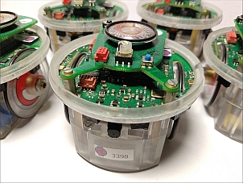

# Robots *Collective* Behavior Demos 

## using *Embedded* Programming  with E-Pucks vers.1 (dsPIC) and *Sound*

BSc Thesis, Jean-Roch LAUPER (2020), [Department of Informatics](http://diuf.unifr.ch), [University of Fribourg](http://www.unifr.ch) (Switzerland)

The main part of this work is a demo set using 1st generation e-pucks (dsPIC) in an *embedded* way. 
The demos emphasize *collective* behavior and make extensive use of e-puck *sound* capabilities ( micros and speakers). 

- **Demo set**: [jr_demo](https://github.com/jrlauper/jrl_epuck/tree/master/jr_demo)
    - the complete list of programs (with youtube links): [link](https://github.com/jrlauper/jrl_epuck/blob/master/jr_demo/programs-list.md)
    - the youtube playlist of demo videos for the set: [link](https://www.youtube.com/playlist?list=PLrscHgSUZPdr38tirAsB4_4Q93khKP9Rv)

- Simple **sound library** enabling to easily produce tones from **pre-recorded** sounds: [jr_wav_music2](https://github.com/jrlauper/jrl_epuck/tree/master/jr_wav_music2)
- A more **advanced** **sound library** enabling to generate any sound **"on the fly"** with more advanced features (sound wave shape, volume control, ...) : [jr_freq_sound](https://github.com/jrlauper/jrl_epuck/tree/master/jr_freq_sound)

The other folders are connected to material described in the report.

